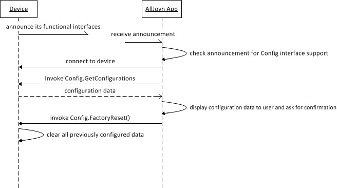

# org.alljoyn.Config version 1

## Theory of Operation

This documents the org.alljoyn.Config interface.  This is a legacy interface
that predates the formation of the Interface Review Board and their guidelines,
thus this interface may violate one or more of the guidelines.

### Definition Overview

The Configuration service framework exposes device-specific methods such as
restart and factory reset, device passcode, and device-specific settable
attributes such as friendly name and default language. It is expected that OEM
of the device would take this service framework and bundle it with a single
application (system app). The enforcement of singleton instance of the
Configuration service framework must be performed using explicit guidelines
provided to OEMs and application developers regarding the usage of the
Configuration service framework.

The following figure illustrates the relationship between software stack on the
device hosting the AllJoyn™ service framework and the device hosting the AllJoyn
client application.

**Figure:** Configuration service framework architecture within the AllJoyn
  framework

The figure describes the scope of Configuration service framework and About
feature in a multiple applications-per-device scenario. The following system
behavior should be noted:

    The system application bundles the Configuration service framework and
    provides a remote mechanism to invoke device-specific configuration.  It
    could be that OEMs provide equivalent (as exposed by the Configuration
    service framework) functionality via the local user interface.

NOTE: All methods and signals are considered mandatory to support the AllSeen
Alliance Compliance and Certification program.

### Typical Call Flows

This section highlights call flows that involve the Configuration service
framework. The system app on the AllJoyn service framework device is involved in
these call flows.

#### Device configuration change

The following figure illustrates a sample call flow where an Alljoyn app
executing on an AllJoyn client device discovers the Configuration service
framework via announcement and subsequently performs methods as specified in the
Config interface to retrieve and update configuration data. See Config Interface
for complete details.

**Figure:** Device configuration change call flow

#### Factory reset

The following figure illustrates a sample call flow where an Alljoyn app
executing on an AllJoyn client device discovers the Configuration service
framework via announcement, and subsequently performs methods as specified in
the Config interface to retrieve the configuration data and perform factory
reset action if needed. See Config Interface for complete details.

**Figure:** Device factory reset call flow

## Specification

|                       |                                                                       |
|-----------------------|-----------------------------------------------------------------------|
| Version               | 1                                                                     |
| Annotation            | org.alljoyn.Bus.Secure = off                                          |

### Methods

#### Restart

This method restarts or poser cycles the device.

Input arguments:

_None_

Output arguments:

_None_

Errors raise by this method:

  * **org.alljoyn.Error.FeatureNotAvailable** --- Restart is not supported.

#### FactoryReset

Directs the device to disconnect from the personal AP, clear all previously
configured data, and start the softAP mode.

Input arguments:
_None_

Output arguments:
_None_

Errors raised by this method:

  * **org.alljoyn.Error.FeatureNotAvailable** --- FactoryReset is not supported.

#### SetPasscode(daemonRealm, passcode)

Updates the passcode to be used for the org.alljoyn.Config interface which is
secure. The default passcode is 000000 until it is overwritten by SetPasscode.

Input arguments:

  * **daemonRealm** --- string --- Identifies the daemon's identity for secure
    access. This parameter is currently ignored by the Configuration service
    framework.
  * **passcode** --- byte[] --- Passphrase that will be utilized for the secure
    Config interface.

Output arguments:
_None_

Errors raised by this method:

_None_

#### GetConfigurations(languageTag) -> (configData)

Returns all the configurable fields specified within the scope of the Config
interface. If language tag is not specified (i.e., ""), configuration fields
based on the device's default language are returned.

Input arguments:

  * **languageTag** --- string --- Language tag used to retrieve Config fields.

Output aruguments:

  * **configData** --- ConfigDictionaryType --- Returns configuration fields in
    the form of dictionary. See Configuration map fields for the default set of
    Configuration map fields.

Errors raised by this method:

  * **org.alljoyn.Error.LanguageNotSupported** --- Returned if a language tag is
    not supported by the device.

#### UpdateConfigurations(languageTag, configMap)

Provides a mechanism to update the configuration fields.

Input arguments:

  * **languageTag** --- string --- Identifies the language tag.
  * **configMap** --- ConfigDictionaryType --- Set of configuration fields being
    updated.

Output arguments:

_None_

Errors raised by this method:

  * **org.alljoyn.Error.InvalidValue** --- Returned whenever there is an error
    in updating the value for a specific field in the configMap. The error
    message will contain the field name of the invalid field.
  * **org.alljoyn.Error.LanguageNotSupported** --- Returned if a language tag is
    not supported by the device.

#### ResetConfigurations(languageTag, fieldList)

Provides a mechanism to reset (i.e., value is restored to factory default but
the field itself is retained) values of configuration fields.

Input arguments:

  * **languageTag** --- string --- Identifies the language tag.
  * **fieldList** --- string[] --- List of fields or configuration items that
    are being reset.

Output arguments:

_None_

Errors raised by this method:

  * **org.alljoyn.Error.InvalidValue** --- Returned whenever there is an error
    in updating the value for a specific field in the configMap. The error
    message will contain the field name of the invalid field.
  * **org.alljoyn.Error.LanguageNotSupported** --- Returned if a language tag is
    not supported by the device.

### Named Types

#### dictionary ConfigDictionaryType

  * **key** --- string --- Config field.
  * **value** --- variant --- Config value.
  
The following table lists the known configuration fields that are part of the
configMap parameter fields. The OEM or application developer can add additional
fields.

| Config Field    | Config Value                                                                                            |
|-----------------|---------------------------------------------------------------------------------------------------------|
| DefaultLanguage | Default language supported by the device.                                                               |
| DeviceName      | Device name assigned by the user. The device name appears on the UI as the friendly name of the device. |

### Interface Errors

The method calls in this interface use the AllJoyn error message handling feature
(`ER_BUS_REPLY_IS_ERROR_MESSAGE`) to set the error name and error message. The table
below lists the possible errors raised by this interface.

| Error name                             | Error message                              |
|----------------------------------------|--------------------------------------------|
| org.alljoyn.Error.LanguageNotSupported | The language tag is not supported.         |
| org.alljoyn.Error.InvalidValue         | Parameter data contained an invalid value. |
| org.alljoyn.Error.FeatureNotAvailable  | Feature is not supported.                  |

## References

  * The XML definition of the [Config interface](Config-v1.xml)
