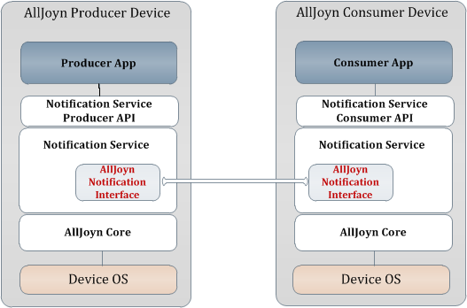
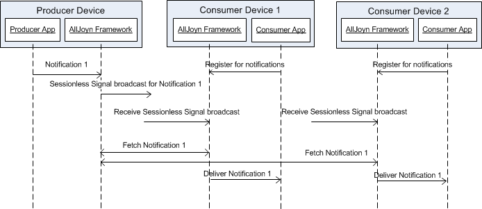

# org.alljoyn.Notification

## Important Note

This interface has been defined prior to the creation of the interface design
guidelines for AllSeen. Many design decisions in this interface do not comply
with the guidelines and constitute bad precedent. Do not use these interfaces as
a template to define your own: they will not pass IRB review.

The latest version of the IRB guidelines can be found on the
[IRB wiki][irb_wiki].

For a detailed annotation of the interface design guideline violations in this
interface, please visit the [Gerrit submission page][gerrit_change].

## Theory of Operation

## Overview

The AllJoyn&trade; Notification Framework enables devices to send
user-presentable information to other devices on the network. _Producers_
prepare and send notifications; _consumers_ listen, receive, and present these
notifications for the user's attention and action. Several producers and
consumers can be active on the AllJoyn&trade; network at the same time.

The framework supports multilingual text, image icon, and audio message content.
Integration with the AllJoyn&trade; Control Panel Framework allows the producer
to supply a control panel object. The consumer can present the controls for
direct user interaction in response to the notification. It's also possible to
implement application-specific content via custom attributes.

### Architecture

The framework can be divided into three primary components:

* Notification Service
* Producer API
* Consumer API

The Notification Service implements the Notification Interface which performs
the work of delivering notification messages.

Depending on the role and capabilities of an application, either or both of the
Producer and Consumer APIs may be used to interact with the Notification
Service.

The following diagram shows how the Notification framework and its components
relate to the AllJoyn&trade; ecosystem.

## A Typical Notification Flow

The figure below illustrates the typical flow of activity amongst a producer and
two consumers.

The producer sends out a notification, which the service transmits as a
sessionless signal over the network. Upon receiving the signal broadcast each
consumer establishes a unicast session with the producer to obtain the message
content. The producer then delivers the content individually to each consumer
that requests it.

## Specification

### Notification Structure

A notification is comprised of a Type, TTL (Time to Live), and a collection of
content fields. The producer is responsible for setting the values of all
necessary fields prior to sending.

#### Message Type and TTL

The message type is one of three predefined values that express the import of
the notification. Multiple notifications of different types may be sent by a
single producer, but only the most recently sent of each type will be persisted.

The TTL determines how long a notification will persist on the producer.
Consumers that connect after the initial send will still receive the
notification if the TTL has not expired. Once the TTL expires, the notification
is permanently removed. Consumers that connect after a notification's TTL has
expired will not receive it.

#### Dismissing a Notification

Consumers can choose to dismiss a notification locally or globally on behalf of
all consumers on the AllJoyn&trade; network. To dismiss locally a consumer
simply stops presenting the notification.

Dismissing a notification globally can be useful when there are several
consumers on a network. Requiring the user to dismiss a notification everywhere
it may be presented would result in a poor experience. An consumer should only
dismiss globally in response to user action.

To dismiss a notification globally, the consumer connects to the producer of the
notification and directs it to cease its broadcast. The producer removes the
notification and sends a sessionless signal to all consumers directing them to
stop presenting the notification. If the producer cannot be reached, the
consumer will send out the dismiss sessionless signal on its own.

[gerrit_change]: https://git.allseenalliance.org/gerrit/6353
[irb_wiki]: https://wiki.allseenalliance.org/interfacereviewboard
