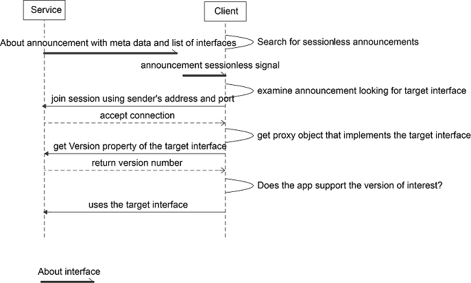

# org.alljoyn.About version 1

## Important Note

This interface has been defined prior to the creation of the interface design
guidelines for AllSeen. Many design decisions in this interface do not comply
with the guidelines and constitute bad precedent. Do not use these interfaces as
a template to define your own: they will not pass IRB review.

The latest version of the IRB guidelines can be found on the
[IRB wiki][irb_wiki].

For a detailed annotation of the interface design guideline violations in this
interface, please visit the [Gerrit submission page][gerrit_change].

## Theory of Operation

The org.alljoyn.About interface is implemented by an app so it can advertise
itself for discovery by other apps on the network. The following figure
illustrates the relationship between a client app and a service app.

**Figure:** About feature architecture within the AllJoyn&trade; framework

**NOTE**: All methods and signals are considered mandatory to support the
AllSeen Alliance Compliance and Certification program.

### Discovery

A client can discover the app via an announcement which is a sessionless signal
containing the basic app information like app name, device name, manufacturer,
and model number. The announcement also contains the list of object paths and
service framework interfaces to allow the client to determine whether the app
provides functionality of interest.

In addition to the sessionless announcement, the About interface also provides
the on-demand method calls to retrieve all the available metadata about the app
that are not published in the announcement.

### Discovery Call Flows

#### Typical discovery flow

The following figure illustrates a typical call flow for a client to discover a
service app. The client merely relies on the sessionless announcement to decide
whether to connect to the service app to use its service framework offering.

**Figure:** Typical discovery flow (client discovers a service app)

#### Nontypical discovery flow

The following figure illustrates a call flow for a client to discover a service
app and make a request for more detailed information.

**Figure:** Nontypical discovery call flow

## About Interface

|            |                              |
|:-----------|:-----------------------------|
| Version    | 1                            |
| Annotation | org.alljoyn.Bus.Secure = off |

### Methods

### GetAboutData(languageTag) -> (aboutData)

Method to retrieve About data.

Input arguments:

  * **languageTag** --- `string` --- The desired language as a
[RFC 5646][rfc_5646] tag.

Output arguments:

  * **aboutData** --- [`AboutDataType`][about_type] --- The About metadata.

### Signals

#### Announce -> (version, port, objectDescription, metaData)

|             |             |
|:------------|:------------|
| Signal Type | sessionless |

This is the About announcement signal.

Output parameters:

  * **version** --- `uint16` --- Service version.
  * **port** --- `uint16` --- Session port available for connection.
  * **objectDescription** --- [`ObjectDescriptionType`][obj_type] ---
    Description of About object.
  * **metaData** --- [`AboutDataType`][about_type] --- The About metadata.

### Named Types

### struct ObjectDescriptionType

  * **objectPath** --- `object path` --- Path of bus object being announced.
  * **interfaces** --- `string[]` --- List of interfaces implemented by object.

### dictionary AboutDataType

  * **key** --- `string` --- Field name.
  * **value** --- `variant`&sup1; --- Field value.

&sup1; &ndash; Use of `variant` type in interfaces violates IRB guidelines. Do
not use this as precedent.

#### About Data Fields

| Name               | Mandatory | Type       | Value meaning                                                             |
|:-------------------|:---------:|:-----------|:--------------------------------------------------------------------------|
| AppId              |    yes    | `byte[]`   | A [RFC 4122][rfc_4122]-compliant GUID for the app.                        |
| DefaultLanguage    |    yes    | `string`   | A [RFC 5646][rfc_5646] language tag declaring the app's default language. |
| DeviceName         |    no     | `string`   | Name of the device set by platform-specific means.                        |
| DeviceId           |    yes    | `string`   | A [RFC 4122][rfc_4122]-compliant GUID for the device.                     |
| AppName            |    yes    | `string`   | The name of the app.                                                      |
| Manufacturer       |    yes    | `string`   | The name of the app manufacturer.                                         |
| ModelNumber        |    yes    | `string`   | The device model number.                                                  |
| SupportedLanguages |    yes    | `string[]` | List of [RFC 5646][rfc_5646] tags declaring app's supported languages.    |
| Description        |    yes    | `string`   | Detailed description of the app.                                          |
| DateOfManufacture  |    no     | `string`   | Date of manufacture in `YYYY-MM-DD` format.                               |
| SoftwareVersion    |    yes    | `string`   | Application version in vendor-defined format.                             |
| AJSoftwareVersion  |    yes    | `string`   | Version of AllJoyn used by app in `major.minor` format (e.g. 16.04).      |
| HardwareVersion    |    no     | `string`   | Hardware version in vendor-defined format.                                |
| SupportUrl         |    no     | `string`   | URL for customer support requests.                                        |

## References

  * The About interface [XML definition](About-v1.xml)

[about_type]: #dictionary-aboutdatatype
[obj_type]: #struct-objectdescriptiontype
[gerrit_change]: https://git.allseenalliance.org/gerrit/6353
[irb_wiki]: https://wiki.allseenalliance.org/interfacereviewboard
[rfc_5646]: https://tools.ietf.org/html/rfc5646
[rfc_4122]: https://tools.ietf.org/html/rfc4122
