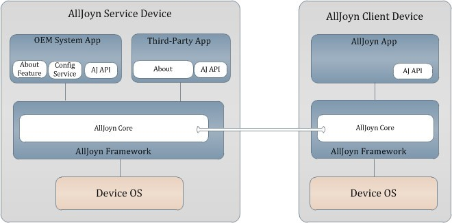
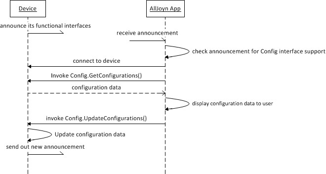

# org.alljoyn.Config version 1

## Important Note

This interface has been defined prior to the creation of the interface design
guidelines for AllSeen. Many design decisions in this interface do not comply
with the guidelines and constitute bad precedent. Do not use these interfaces as
a template to define your own: they will not pass IRB review.

The latest version of the IRB guidelines can be found on the
[IRB wiki][irb_wiki].

For a detailed annotation of the interface design guideline violations in this
interface, please visit the [Gerrit submission page][gerrit_change].

## Theory of Operation

The org.alljoyn.Config interface exposes device-specific methods such as
restart and factory reset, device passcode, and device-specific settable
attributes such as friendly name and default language. It is expected that the
device OEM would take this service framework and bundle it with a single
application (system app). The enforcement of a singleton instance of the
Configuration service framework must be performed using explicit guidelines
provided to OEMs and application developers regarding the usage of the
Configuration service framework.

The following figure illustrates the relationship between the software stack on
the device hosting the Configuration service framework and the device hosting
the consumer application.

**Figure:** Configuration service framework architecture within the AllJoyn
  framework

The figure describes the scope of Configuration service framework and About
feature in a multiple applications-per-device scenario. The following system
behavior should be noted:

    The system application bundles the Configuration service framework and
    provides a remote mechanism to invoke device-specific configuration.  It
    could be that OEMs provide equivalent (as exposed by the Configuration
    service framework) functionality via the local user interface.

NOTE: All methods and signals are considered mandatory to support the AllSeen
Alliance Compliance and Certification program.

### Typical Call Flows

This section highlights call flows that involve the Configuration service
framework. The system app on the AllJoyn service framework device is involved in
these call flows.

#### Device configuration change

The following figure illustrates a sample call flow where an Alljoyn app
executing on an AllJoyn client device discovers the Configuration service
framework via announcement and subsequently performs methods as specified in the
Config interface to retrieve and update configuration data.

**Figure:** Device configuration change call flow

#### Factory reset

The following figure illustrates a sample call flow where an Alljoyn app
executing on an AllJoyn client device discovers the Configuration service
framework via announcement, and subsequently performs methods as specified in
the Config interface to retrieve the configuration data and perform factory
reset action if needed.

**Figure:** Device factory reset call flow

## Specification

|            |                               |
|:-----------|:------------------------------|
| Version    | 1                             |
| Annotation | org.alljoyn.Bus.Secure = true |

### Methods

#### Restart

This method restarts the app or power cycles the device.

Input arguments:

_None_

Output arguments:

_None_

Errors raised by this method:

  * **org.alljoyn.Error.FeatureNotAvailable** --- Restart is not supported.

#### FactoryReset

_This method is deprecated. Use the mandatory Security 2.0 Reset() method
instead for all future applications._

Directs the device to disconnect from the network and clear all previously
configured data.

Input arguments:
_None_

Output arguments:
_None_

Errors raised by this method:

  * **org.alljoyn.Error.FeatureNotAvailable** --- FactoryReset is not supported.

#### SetPasscode(daemonRealm, passcode)

Updates the passcode to be used for the org.alljoyn.Config interface which is
secure. The default passcode is 000000 until it is overwritten by SetPasscode.

Input arguments:

  * **daemonRealm** --- `string` --- This parameter is currently ignored.
  * **passcode** --- `byte[]` --- Passcode for the secure Config interface.

Output arguments:
_None_

Errors raised by this method:

_None_

#### GetConfigurations(languageTag) -> (configData)

Returns all the configurable fields specified within the scope of the Config
interface. If language tag is not specified (i.e., ""), configuration fields
based on the app's default language are returned.

Input arguments:

  * **languageTag** --- `string` --- [RFC 5646][rfc_5646] tag specifying
    language to return fields for.

Output arguments:

  * **configData** --- [`ConfigDictionaryType`][config_type] --- A set of
    configuration fields.

Errors raised by this method:

  * **org.alljoyn.Error.LanguageNotSupported** --- The requested language is not
    supported by the app.

#### UpdateConfigurations(languageTag, configMap)

Provides a mechanism to update the configuration fields.

Input arguments:

  * **languageTag** --- `string` --- [RFC 5646][rfc_5646] tag specifying
    language for which these updates apply.
  * **configMap** --- [`ConfigDictionaryType`][config_type] --- The set of
    updated configuration fields.

Output arguments:

_None_

Errors raised by this method:

  * **org.alljoyn.Error.InvalidValue** --- Returned if any field fails to
    update. The name of the field is noted in the error message.
  * **org.alljoyn.Error.LanguageNotSupported** --- The requested language is not
    supported by the app.

#### ResetConfigurations(languageTag, fieldList)

Provides a mechanism to reset (i.e., value is restored to factory default but
the field itself is retained) values of configuration fields.

Input arguments:

  * **languageTag** --- `string` --- [RFC 5646][rfc_5646] tag specifying
    language for which the following list of fields applies.
  * **fieldList** --- `string[]` --- Set of configuration fields to be reset.

Output arguments:

_None_

Errors raised by this method:

  * **org.alljoyn.Error.InvalidValue** --- Returned if any field fails to reset.
    The name of the field is noted in the error message.
  * **org.alljoyn.Error.LanguageNotSupported** --- The requested language is not
    supported by the app.

### Named Types

#### dictionary ConfigDictionaryType

  * **key** --- `string` --- Field key.
  * **value** --- `variant`&sup1; --- Field value.

&sup1; &ndash; Use of `variant` type in interfaces violates IRB guidelines. Do
not use this as precedent.

The following table lists all pre-defined configuration fields. The OEM or
application developer can add additional fields.

| Config Field    | Config Value                                                     |
|:----------------|:-----------------------------------------------------------------|
| DefaultLanguage | [RFC 5646][rfc_5646] tag specifying default language of the app. |
| DeviceName      | Device name assigned by the user.                                |

### Interface Errors

The method calls in this interface use the AllJoyn error message handling
feature (`ER_BUS_REPLY_IS_ERROR_MESSAGE`) to set the error name and error
message. The table below lists the possible errors raised by this interface.

| Error name                             | Error message                              |
|:---------------------------------------|:-------------------------------------------|
| org.alljoyn.Error.LanguageNotSupported | The language is not supported.             |
| org.alljoyn.Error.InvalidValue         | Parameter data contained an invalid value. |
| org.alljoyn.Error.FeatureNotAvailable  | Feature is not supported.                  |

## References

  * The Config interface [XML definition][config_xml]

[config_type]: #dictionary-ConfigDictionaryType
[config_xml]: Config-v1.xml
[gerrit_change]: https://git.allseenalliance.org/gerrit/6353
[irb_wiki]: https://wiki.allseenalliance.org/interfacereviewboard
[rfc_5646]: https://tools.ietf.org/html/rfc5646
