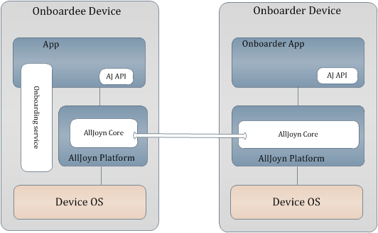
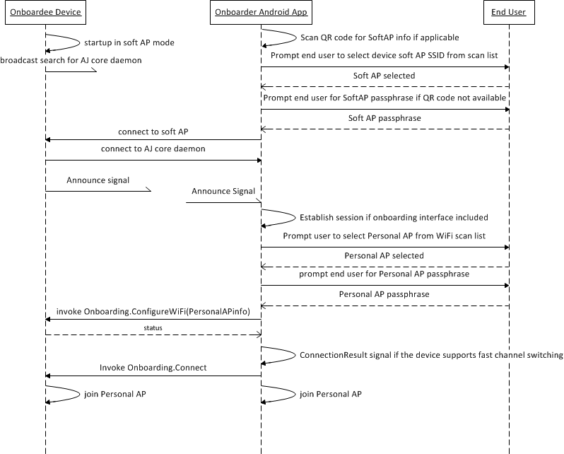
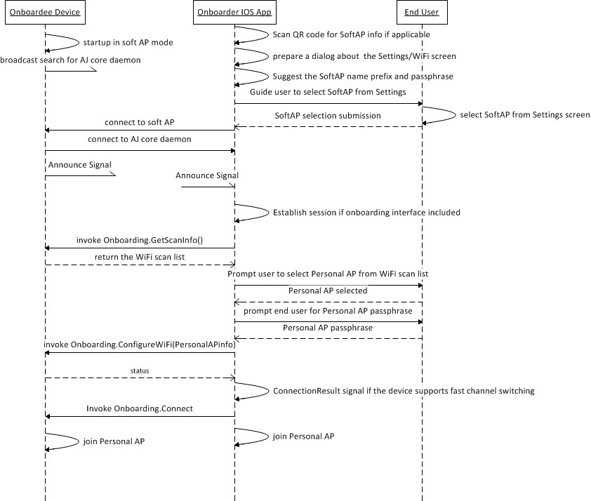

# org.alljoyn.Onboarding version 1

## Important Note

This interface has been defined prior to the creation of the interface design
guidelines for AllSeen. Many design decisions in this interface do not comply
with the guidelines and constitute bad precedent. Do not use these interfaces as
a template to define your own: they will not pass IRB review.

The latest version of the IRB guidelines can be found on the
[IRB wiki][irb_wiki].

For a detailed annotation of the interface design guideline violations in this
interface, please visit the [Gerrit submission page][gerrit_change].

## Theory of Operation

The Onboarding service provides a common and simple way for new device to be
brought onto the AllJoyn&trade; network. This is especially useful for devices
that have a limited user interface, like a SmartPlug.

Onboarding currently supports Wi-Fi only, though the system can evolve to
leverage additional protocols (like BTLE) as they become more prevalent in this
class of devices.

### How Does it Work?

The org.alljoyn.Onboarding interface is implemented by an application on a
target device, referred to as an onboardee. A typical onboardee is an
AllJoyn&trade; thin client device. This interface allows the onboarder to send a
set of network ID and credentials to the onboardee to allow it to join a target
network.

**Figure:** Onboarding service framework architecture within the AllJoyn
framework

Onboarding is more robust when the onboardee supports concurrent network
connections. Sometimes known as "fast channel switching", concurrent connection
allows the onboardee to retain its SoftAP connection to the onboarder while
simultaneously connecting to the target network. Staying connected to the
onboarder means the onboardee can immediately report the success or failure of
its attempt to connect to the target network. The onboarding service supports
devices with and without concurrent connection capabilities.

Because the onboarding service was implemented prior to the establishment of the
AllJoyn interface design guidelines, it supports the optional method,
GetScanInfo. The use of optional methods is no longer acceptable practice and
their use in this interface should not be used as precedent when defining new
interfaces.

**NOTE:** All methods and signals are considered mandatory to support the
AllSeen Alliance Compliance and Certification program.

### Call Flows

#### Onboarding call flow using an Android onboarder

The following figure illustrates a call flow for onboarding an onboardee using
an Android onboarder.

**Figure:** Onboarding a device using an Android onboarder

#### Onboarding call flow using an iOS onboarder

The following figure illustrates a call flow for onboarding an onboardee using
an iOS onboarder.

**Figure:** Onboarding a device using an iOS onboarder

## Specification

|            |                              |
|:-----------|:-----------------------------|
| Version    | 1                            |
| Annotation | org.alljoyn.Bus.Secure = off |

### Properties

#### State

|            |                                                          |
|:-----------|:---------------------------------------------------------|
| Type       | `int16`                                                  |
| Access     | read-only                                                |
| Annotation | org.freedesktop.DBus.Property.EmitsChangedSignal = false |

The configuration state.  Possible values:

  * 0 --- Personal AP Not Configured
  * 1 --- Personal AP Configured/Not Validated
  * 2 --- Personal AP Configured/Validating
  * 3 --- Personal AP Configured/Validated
  * 4 --- Personal AP Configured/Error
  * 5 --- Personal AP Configured/Retry

#### LastError

|            |                                                          |
|:-----------|:---------------------------------------------------------|
| Type       | [`LastErrorStruct`][error_type]                          |
| Access     | read-only                                                |
| Annotation | org.freedesktop.DBus.Property.EmitsChangedSignal = false |

The last error code and error message received from the underlying Wi-Fi layer.
Possible error codes:

  * 0 --- Validated
  * 1 --- Unreachable
  * 2 --- Unsupported protocol
  * 3 --- Unauthorized
  * 4 --- Error message

### Methods

#### ConfigureWiFi(SSID, passphrase, authType) -> status

Sends the personal AP information to the onboardee. When the authType is equal
to -1 (any), the onboardee must try out all the possible authentication types it
supports to connect to the personal AP.

Input arguments:

  * **SSID** --- `string` --- Access point SSID.
  * **passphrase** --- `string` --- Access point passphrase.
  * **authType** --- `int16` --- Authentication type.  Possible values:
    * -3 --- WPA2 Auto
    * -2 --- WPA Auto
    * -1 --- Any
    *  0 --- Open
    *  1 --- WEP
    *  2 --- WPA TKIP
    *  3 --- WPA CCMP
    *  4 --- WPA2 TKIP
    *  5 --- WPA2 CCMP
    *  6 --- WPS

Output arguments:

  * **status** --- `int16` --- Response status.  Possible values:
    * 1 --- Current SoftAP mode will be disabled upon receipt of Connect. In
      this case, the onboarder must wait for the device to connect on the
      personal AP and query the State and LastError properties.
    * 2 --- Concurrent connection is used to confirm the personal AP connection.
      In this case, the onboarder must wait for the ConnectionResult signal to
      arrive over the AllJoyn session established over the SoftAP link.

Errors raised by this method:

  * org.alljoyn.Error.OutOfRange --- Returned in the AllJoyn method call reply
    if authType parameter is invalid.

#### Connect()

Tells the onboardee to connect to the personal AP. It is recommended that the
onboardee use the concurrent connection feature, if it is available.

Input arguments:

_None_

Output arguments:

_None_

Errors raised by this method:

_None_

#### Offboard()

Tells the onboardee to disconnect from the personal AP, clear the personal AP
configuration fields, and start the soft AP mode.

Input arguments:

_None_

Output arguments:

_None_

Errors raised by this method:

_None_

#### GetScanInfo() -> (age, scanList)

Scans all the Wi-Fi access points in the onboardee's proximity.

Input arguments:

_None_

Output arguments:

  * **age** --- `uint16` --- Duration in minutes since last network scan was
    performed.
  * **scanList** --- [`ScanListStruct[]`][scan_type] --- List of network IDs and
    their corresponding authentication types.

Errors raised by this method:

  * org.alljoyn.Error.FeatureNotAvailable --- Returned in the AllJoyn response
    if the device does not support this feature.

### Signals

#### ConnectionResult&sup1; -> (resultCode, resultsMessage)

|             |             |
|:------------|:------------|
| Signal Type | sessioncast |

&sup1; &ndash; This signal does not follow IRB naming guidelines. Do not use
this as precedent.

This signal is emitted when the connection attempt against the personal AP is
completed. The signal is sent over the AllJoyn session established over the
SoftAP link.

This signal will only be emitted if the onboardee supports concurrent network
connections, so it can switch back to the SoftAP to emit this signal to the
onboarder.

Output arguments:

  * **resultCode** --- `int16` --- Connection result code.  Possible values are:
    * 0 --- Validated
    * 1 --- Unreachable
    * 2 --- Unsupported protocol
    * 3 --- Unauthorized
    * 4 --- Error message
  * **resultMessage** --- `string` --- Text that describes the connection
    result. The language of the text is undefined. Current implementation is
    English-only. _This is a legacy design and does not follow current interface
    design guidelines_.

### Named Types

#### struct LastErrorStruct

The last error code and error message received from the underlying Wi-Fi layer.

  * **errorNumber** --- `int16` --- Error number.
  * **errorString** --- `string` --- Error message string. The language of the
    text is undefined. Current implementation is English-only. _This is a legacy
    design and does not follow current interface design guidelines_.

#### struct ScanListStruct

Access point SSID and Auth Type.

  * **ssid** --- `string` --- Access point SSID.
  * **authType** --- `int16` ---  Access point authentication scheme:
    *  0 --- Open
    *  1 --- WEP
    *  2 --- WPA TKIP
    *  3 --- WPA CCMP
    *  4 --- WPA2 TKIP
    *  5 --- WPA2 CCMP
    *  6 --- WPS

### Interface Errors

| Error name                            | Error message                  |
|:--------------------------------------|:-------------------------------|
| org.alljoyn.Error.OutOfRange          | authType parameter is invalid. |
| org.alljoyn.Error.FeatureNotAvailable | Feature not supported.         |

## References

  * The Onboarding interface [XML definition](Onboarding-v1.xml)

[scan_type]: #struct-lasterrorstruct
[error_type]: #struct-scanliststruct
[gerrit_change]: https://git.allseenalliance.org/gerrit/6353
[irb_wiki]: https://wiki.allseenalliance.org/interfacereviewboard
[rfc_5646]: https://tools.ietf.org/html/rfc5646
